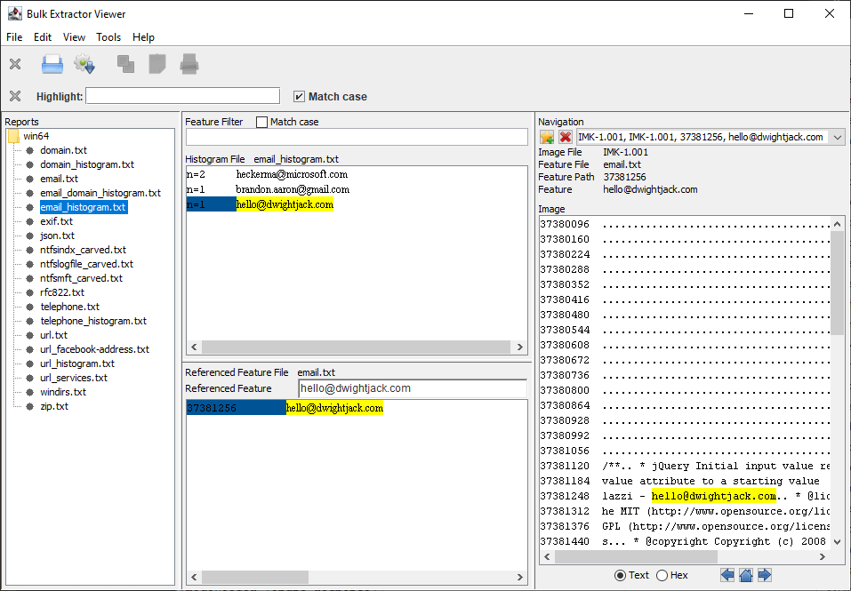
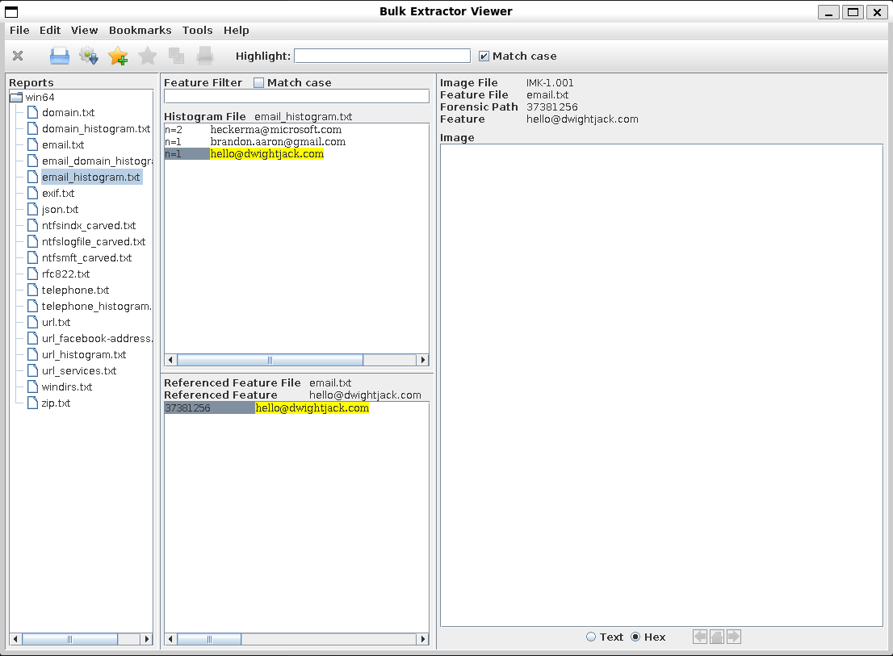

## BEViewer Build Modernisation Project

### Bugs
* Where did the bookmarks go?
* Thread contention somewhere, sticky UI
* Hundreds of warnings

### Pressing Build Challenges
* Repeatable builds with externally versioned artifacts
* Pick up `jlink` for cross-platform builds,native if possible
* License?
* Merge with existing `doxygen` docs
* Merge back to mono-repo via `make` or standalone? 
    * a versioned API interaction would allow for split-repos
    * Read be20_api, especially https://github.com/simsong/be20_api/blob/872be6233f97db650c85ea13f379e4b9d12bad2b/path_printer.cpp#L286
    * TLS options between the components
* GitHub actions build
    * Vulnerability scanning
    * Packaging and Releasing
  
### Pressing Technical Challenges
* Deprecated internal comms with `Observable` 
* API interaction via HTTP-ish `Process` based input/output stream handling
* Package layout/structure - currently all in `default` package
* Externalise logging
* Tests
    * Unit tests and/or replace with proven libraries e.g. `StringEscapeUtils`
    * Component tests to cover API interactions
* Plan for future and broader maintenance

### Fit and Finish
* Pick up `Flatlaf` for consistent cross-platform appearance
* Pick up modern font handling
* Flame/Heat map
* Review javadoc

### Built and running using Java 24

### 1.5 Running on Java 24
