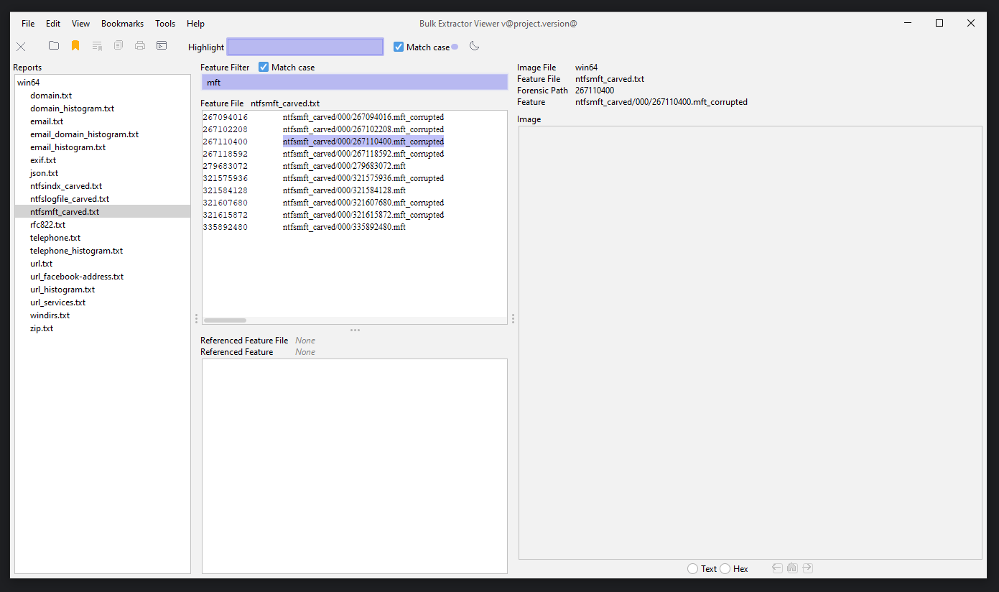

## BEViewer Build Modernisation Project

### Bugs
* Where did the bookmarks go?
* Thread contention somewhere, sticky UI
* Hundreds of warnings

### Pressing Build Challenges
* Repeatable builds with externally versioned artifacts
* Pick up `jlink` for cross-platform builds,native if possible
* License?
* Merge with existing `doxygen` docs
* Merge back to mono-repo via `make` or standalone? 
    * a versioned API interaction would allow for split-repos
    * Read be20_api, especially https://github.com/simsong/be20_api/blob/872be6233f97db650c85ea13f379e4b9d12bad2b/path_printer.cpp#L286
    * TLS options between the components
* GitHub actions build
    * Vulnerability scanning
    * Packaging and Releasing
  
### Pressing Technical Challenges
* Deprecated internal comms with `Observable` 
* API interaction via HTTP-ish `Process` based input/output stream handling
* Package layout/structure - currently all in `default` package
* Externalise logging
* Tests
    * Unit tests and/or replace with proven libraries e.g. `StringEscapeUtils`
    * Component tests to cover API interactions
* Plan for future and broader maintenance

### Fit and Finish
* Pick up `Flatlaf` for consistent cross-platform appearance
* Pick up modern font handling
* Basic i18n support
* Flame/Heat map
* Review javadoc

### Built and running using Java 24

### 1.5 Running on Java 24

## Process
* ~~Walk back through tags to find buildable UI.~~
* ~~Cherry-pick to `v1.6.0` after which the `java_gui` disappears~~
* ~~No major architectural changes, begin to organise into packages~~
* Ooof. So much `static`. 
    * ~~Lots of work done with a static ref to a queue and listeners. 100's of lines that could be replaced with a `synchronizedList`~~
    * ~~Small DI, maybe `Dagger`?~~ Complete
* ~~Encapsulate State~~
* ~~Separate I/O~~
* ~~Separate API - This is a massive challenge~~
> the "API contract" is actually HTTP over stdio.
* ~~Toolbars merged - reflect on this~~
* ~~Logging currently dumps to memory~~ - created an infinite scroll window replacement
> The core issue is that the code makes a naive assumption about UTF-8 to UTF-16 conversion, simply padding each byte with a zero, which is incorrect. A proper conversion requires using the correct character encoding classes.

> It incorrectly assumes UTF-8 is a single-byte encoding and that UTF-16 is simply a two-byte padded version. 
* ~~Wonky Charset conversions~~ Added icu4j to handle Charset transforms
* From file to Path if possible, possible just do later

* ~~Theme L&F switcher~~ - Implemented 
* ~~highlight(accent) colour switcher~~ - Implemented
* log level switcher, to do later
* Anti-alias LCD hints, some complete for Features and Image which require
* SwingWorker - warm up the big UI objects

## Work in Progress UI

## Major Complete

* Port from `make` to Maven
  * `mvn clean install` locally to pull dependencies and build `BEViewer.jar`
* `Flatlaf` support for frontend
* Java 24 `latest` support and build
* Move to DI with `Dagger` to support unit/component testing and better component interdependency management
    * Removes the majority of the use of `static` 
* File based logging with configurable rollover replaces in-memory boundless buffer
* Standard package layout
* Move from `Foo extend Thread` to Tasks running on `VirtualThread` executors.

### Minor Complete
* Colour picker for Highlight colours - user selectable
* Dark mode switch for L&F
* Icons moved to `svg`
* `commons-text` and other supporting tools replacing DIY implementations
* AntiAlias support with `Graphics2D`
* Remove and replace deprecated `Observer` with `PropertyChangeListener`
* Start i18n support
* `picocli` for robust CLI interaction
* `icu4j` support for correct Charset handling

## Major not yet
* Matrix builds on GitHub Actions using `jlink` to generate a minimal `JRE` and `jpackage` to generate a native executable for win/mac/linux. 
  * _No Java install will be required to run BEViewer_
* API Contract
* Heavy UI components which could be warmed-up before use
* Component tests `listener -> processor -> listener`
* Unit tests for minor logic and decision points
* AOB from _Pressing concerns_
* Documentation

### Minor not yet
* Font consistency
* Missing icons
* SVG render height
* Log level runtime switching 
* Full SemVer versioning support
   * `${tag_major}.${tag_minor}.${buildNumber}`
* With test coverage port from `File` to `Path`
* `TODO`s e.g. `BEToolbar`